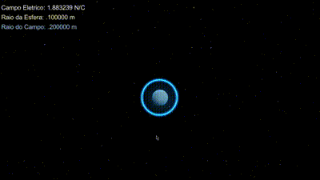

# Physics 2 - Eletric Field

Hey there!

Welcome to my Physics 2 project! 🚀 (old project, 2018)

In this project, I tackled a problem assigned by our professor where we had to create a program that transforms static physics values into dynamic ones. This means we can input different values and observe the corresponding outputs, rather than having fixed answers.

For my project, I decided to work on calculating the Electric Field value based on the radius of the magnetic field and a physical sphere within that magnetic field.

To test out the program, simply open the 'Fisica2.exe' file located in the 'Windows4.0color_Fisica2' folder. Once launched, you can control the radius of the sphere by right-clicking and adjust the magnetic field with a left-click.

I built this "game" using Unity, a tool I was comfortable with at the time. While the graphical representation isn't true to real life, it does look pretty cool if I do say so myself!

Enjoy! 😊

